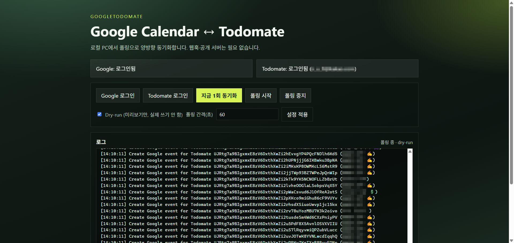

# GODA

**GODA** (고다) — short for **GOogletoDomAte**.

Local bidirectional sync between **Google Calendar** and **Todomate**.



The primary client is a **Go desktop GUI** that opens a local control UI in your browser. No public webhook endpoint or reverse proxy is required for this local polling mode.

## Features

- Sync active Todomate goals only (`finishType` empty)
- Skip completed Todomate items by default (`skip_completed_todos`)
- Prune Google events when the source todo is deleted or its goal becomes inactive
- Optional Google → Todomate import (`import_unmapped_google_events`)
- Local SQLite mapping store
- Dry-run mode for safe previews

## Requirements

- Go 1.22+ (to build)
- Google Cloud **Desktop OAuth** client JSON (`credentials.json`) — you create this manually
- Todomate account (email/password)

## Setup

```powershell
copy config.example.toml config.local.toml
```

1. Create a Google Cloud project
2. Enable **Google Calendar API**
3. Configure the OAuth consent screen (add yourself as a test user)
4. Create an OAuth client ID of type **Desktop app**
5. Download the JSON and save it as `credentials.json` in the project root
6. In `config.local.toml`, set `todomate.api_key` to the Todomate Firebase web API key (do not commit this file)

Tune `config.local.toml` as needed. Keep `dry_run = true` for the first runs.

## Auth files created by the client

| File | Created by login? | Notes |
| --- | --- | --- |
| `credentials.json` | **No** | Must be downloaded from Google Cloud Console and placed manually |
| `token.json` | **Yes** (Google login) | Created/updated after OAuth succeeds |
| `todomate_session.json` | **Yes** (Todomate login) | Created/updated after email/password login |
| `config.local.toml` | **No** | Copy from `config.example.toml` yourself |

## Run the GUI

```powershell
go build -buildvcs=false -o bin/goda.exe ./cmd/g2d
.\bin\goda.exe
```

The UI opens automatically and supports:

- Google login / Todomate login
- Dry-run toggle
- One-shot sync / polling start & stop
- Live logs

## Optional Python CLI

```powershell
py -3 -m venv .venv
.\.venv\Scripts\Activate.ps1
pip install -r requirements.txt
pip install -e .
google-to-domate --once -v
```

## Project layout

```
cmd/g2d/main.go
internal/
  config/ googleauth/ googlecal/ todomate/ store/ syncer/ ui/
assets/goda-camo-icon.png
screenshots/001.png
src/google_to_domate/          # Python CLI (legacy)
docs/todomate-api-notes.md
config.example.toml
```

## Notes

- Todomate has no official public API. This project uses an unofficial Firebase/Firestore integration that may break when Todomate changes.
- Webhooks are not used in the local GUI mode. Google push would need an always-on public HTTPS endpoint; Todomate still has no webhook support.
- Do not commit secrets: `credentials.json`, `token.json`, `todomate_session.json`, `config.local.toml`.
